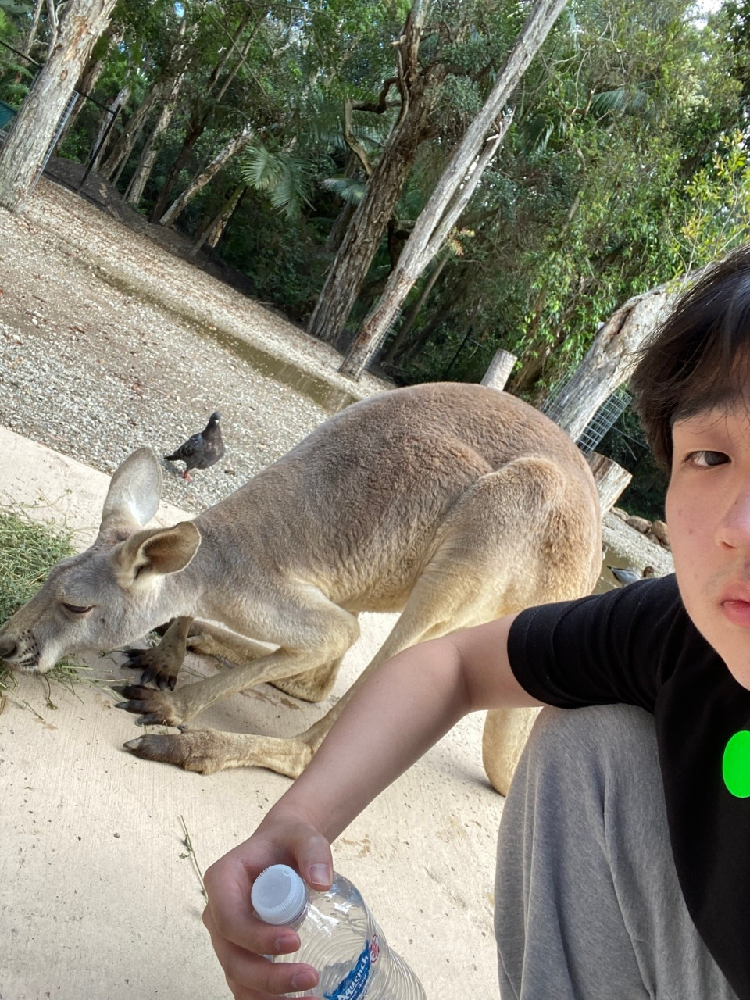

<!DOCTYPE html>
<html lang="ko">
<head>
    <meta charset="UTF-8">
    <meta name="viewport" content="width=device-width, initial-scale=1.0">
    <title>인물 소개</title>
    <link rel="stylesheet" href="index.css"> <!-- 외부 CSS 파일 연결 -->
</head>
<body>
    <h1>김연준</h1>

    

        

            
        

        

            <table class="profile-table">
                <tr>
                    <th>이름</th>
                    <td>김연준</td>
                </tr>
                <tr>
                    <th>출생</th>
                    <td>2001년 8월 15일</td>
                </tr>
                <tr>
                    <th>국적</th>
                    <td>대한민국</td>
                </tr>
                <tr>
                    <th>본관</th>
                    <td>경주 김씨(慶州 金氏)</td><!-- 괄호 식별자로 바꿀 것것 -->
                </tr>
                <tr>
                    <th>학력</th>
                    <td>부광초등학교 개림초등학교 개림중학교 부명중학교 부명고등학교 인천대학교</td>
                </tr>
                <tr>
                    <th>학번</th>
                    <td>202001622</td>
                </tr>
                <tr>
                    <th>전공</th>
                    <td>정보통신공학과</td>
                </tr>
            </table>
        

    

</body>
</html>
